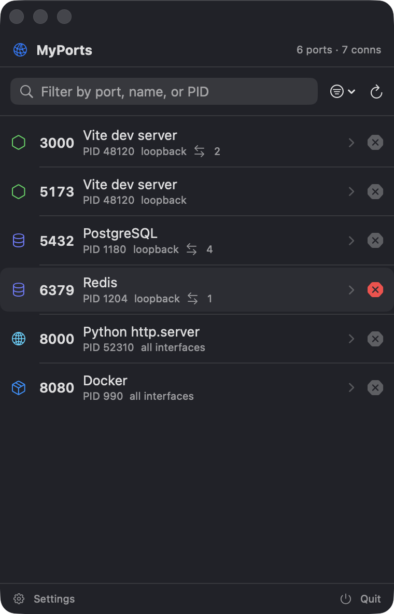
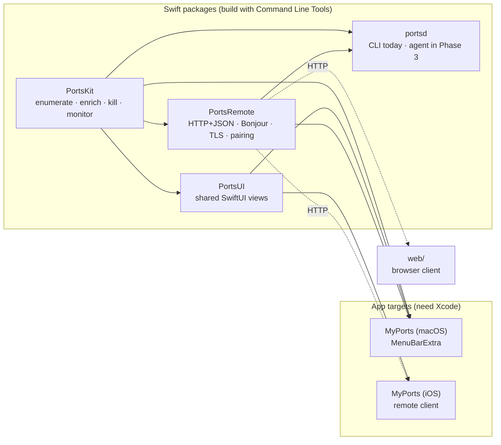

# MyPorts

See which TCP ports are open on your Mac, which app owns each one, and kill a
stray dev server or free a port in two clicks — during local development and web
testing.



> Status: early development. `PortsKit`, the `portsd` CLI and the **macOS
> menu-bar app** are implemented; the network agent, web UI, and iOS app are on
> the roadmap below. The shot above is the app UI rendered with sample data via
> `swift run PortsPreviewApp`.

## Features

- **Listening ports at a glance** — one row per listening TCP port with the port
  number, owning process, PID, bound address, and a friendly service name
  ("Vite dev server", "PostgreSQL", "Docker", …).
- **Established connections on demand** — expand a port to see the connections
  currently open against it.
- **Kill the right way** — `SIGTERM` first, escalate to `SIGKILL` if the process
  ignores it, and offer an administrator-authenticated kill when the process is
  not yours.
- **Live** — a polling monitor emits a fresh snapshot on an interval (default
  2 s) with a computed diff.
- **Planned** — a menu-bar app, a paired remote agent with a browser UI, and an
  iOS app to view and kill ports on your machines from your phone.

## Requirements

- macOS 14 or later.
- `/usr/sbin/lsof` (ships with macOS).
- **Command Line Tools** are enough to build `PortsKit` and `portsd`.
- **Full Xcode** is required for the macOS and iOS app targets, and to run the
  test suite locally (`XCTest`/`swift-testing` ship with Xcode, not the CLT).

## Install & build

```sh
git clone <repo-url> myports
cd myports
swift build                     # PortsKit, PortsUI, portsd, PortsPreviewApp
swift run portsd list           # try the CLI
swift run PortsPreviewApp       # windowed preview of the app UI (sample data)
```

The macOS menu-bar app is an Xcode target. Its `MyPorts.xcodeproj` is generated
from [`project.yml`](project.yml) with [XcodeGen](https://github.com/yonaskolb/XcodeGen)
and is git-ignored:

```sh
brew install xcodegen
make app                        # xcodegen generate + xcodebuild
# then run .build/dd/Build/Products/Debug/MyPorts.app
```

The browser client lives in [`web/`](web/) (TypeScript + Vite):

```sh
cd web && npm ci && npm run build   # → web/dist, serve via `portsd serve --web-root`
npm run dev                         # or hack on it against a running agent
```

Install the CLI on your PATH:

```sh
swift build -c release
cp .build/release/portsd /usr/local/bin/
```

## Usage (`portsd` CLI)

```sh
# List every listening TCP port
portsd list

# Only loopback-bound ports, or a single port
portsd list --loopback-only
portsd list --port 3000

# Machine-readable
portsd list --json

# Free a port: SIGTERM, then SIGKILL if needed (asks first)
portsd kill 3000

# Skip the prompt / force SIGKILL immediately
portsd kill 3000 --yes
portsd kill 3000 --force
```

`portsd kill` prints a clear message when the process is not yours; re-run with
`sudo`, or use the app's "Kill as Administrator" once it exists.

### Remote agent (`portsd serve`)

The agent exposes the same data over **HTTPS+JSON** (self-signed TLS) so the
MyPorts iOS app or a browser can view and kill ports on this Mac. It advertises
itself on the LAN via Bonjour (`_myports._tcp`).

```sh
# Run the agent — 127.0.0.1:7333 over HTTPS; a cert is generated on first run
portsd serve
portsd serve --lan --pair          # reachable on the LAN, print a pairing URL
portsd serve --readonly            # viewers can look but not kill
portsd serve --web-root web/dist   # also serve the browser client at /
#   (build it first: cd web && npm ci && npm run build)

# Tokens: pair a device with a QR from the macOS app, or mint one directly
portsd token add --label "my phone"
portsd token list
portsd token revoke <id>

# What did remote clients do?
portsd audit
```

API, all under `/api/v1`, bearer-authenticated except `GET /device` and
`POST /pair`:

| Method + path | Purpose |
| --- | --- |
| `GET /device` | API version, hostname, read-only flag (no auth). |
| `POST /pair` | Exchange a single-use pairing token (`Bearer`) for a lasting token. |
| `GET /ports` | The current listening-port snapshot. |
| `GET /ports/{port}/connections` | Established connections for a port. |
| `POST /ports/{port}/kill` | `{"signal":"TERM"\|"KILL"}`; 403 in read-only; rate-limited. |
| `GET /events` | SSE stream pushing a `ports` snapshot on every scan. |

**Security** (see [`docs/adr/0003`](docs/adr/0003-remote-access-security-model.md)):
loopback by default, LAN only with `--lan`; always TLS with a persisted
self-signed cert whose SHA-256 fingerprint clients pin; pairing is a single-use
token (≈10 min TTL) exchanged for a per-client bearer token; read-only mode;
per-token kill rate limit; every kill is written to an audit log.

Config via env (see [`.env.example`](.env.example)): `MYPORTS_BIND`,
`MYPORTS_PORT`, `MYPORTS_READONLY`, `MYPORTS_DATA_DIR`. Hashed tokens, the audit
log and the TLS identity live in `~/Library/Application Support/MyPorts/`. The
macOS app's **Settings › Remote Access** runs the same agent in-process and shows
the pairing QR, paired devices and recent activity.

## Architecture



Layered, with every collaborator injected so the logic tests without spawning a
subprocess or signalling a real process:

| Layer | Type | Responsibility |
| --- | --- | --- |
| `CommandRunner` | protocol | Run `lsof` (real) or replay a fixture (test). |
| `LsofParser` | value | Parse `lsof -F` field output into `RawSocket`s. |
| `ProcessInspector` | protocol | `proc_pidpath` / `proc_pidinfo` / `KERN_PROCARGS2` enrichment. |
| `FriendlyNameResolver` | protocol | Command + args → recognisable label and category. |
| `PortScanner` | value | Orchestrate the above into `[ListeningPort]`. |
| `Signaler` / `PortKiller` | protocol / value | `kill(2)` and the terminate → kill → privileged ladder. |
| `PortsMonitor` | actor | Poll `PortScanner` on an interval, publish an `AsyncStream`. |
| `PortsService` | value | The public entry point wiring real defaults. |
| `PortsViewModel` | `@Observable` | (PortsUI) live snapshot + search/sort/filter + per-row kill escalation. |
| `PortsRootView` | SwiftUI | (PortsUI) the whole popover; reused by the macOS app and, later, iOS. |
| `MyPortsApp` | SwiftUI `App` | (Apps/MyPorts-macOS) `MenuBarExtra` scene, Settings, launch-at-login. |
| `PortsAgent` | value | (PortsRemote) builds the Hummingbird app: TLS, auth, routes, SSE, Bonjour. |
| `FileTokenStore` / `RateLimiter` / `FileAuditLog` / `PairingBroker` | actors | (PortsRemote) hashed bearer tokens, per-token kill limit, JSONL audit trail, single-use pairing tokens. |
| `IdentityStore` | enum | (PortsRemote) load/generate the persisted self-signed TLS identity + fingerprint. |
| `RemoteAccessController` | `@Observable` | (Apps/MyPorts-macOS) runs the agent in-process; drives the Remote Access settings tab. |

See [`docs/adr/`](docs/adr/) for the decisions behind the stack, the choice of
`lsof`, and the remote-access security model.

## Roadmap

- [x] **Phase 0 — Setup**: repo, SwiftPM skeleton, CI (lint + test), CodeQL,
      Dependabot, README, ADRs, `protect-main` ruleset (PR + green CI required).
- [x] **Phase 1 — `PortsKit`**: `lsof` runner + parser (fixtures), process
      enrichment, friendly-name heuristics, `Signaler` / `PortKiller`,
      `PortsMonitor`, full unit tests (36, green on CI). A working `portsd` CLI
      (`list`, `kill`).
- [x] **Phase 2 — macOS menu-bar app**: `MenuBarExtra` popover, `PortsUI` shared
      views, port list with search/sort/loopback filter, expandable process
      detail + established connections, kill flow (confirm → SIGTERM/SIGKILL →
      "Kill as Admin"), Settings (refresh interval, launch at login). Built via
      XcodeGen + `xcodebuild` (CI `app-macos` job).
- [~] **Phase 3 — Agent + web**
  - [x] **3a**: `PortsRemote` + `portsd serve` — JSON API, SSE `/events`, bearer
        tokens (hashed, `portsd token …`), read-only mode, per-token kill
        rate-limit, audit log (`portsd audit`). Loopback only. 15 tests.
  - [x] **3b**: self-signed TLS (persisted, fingerprint pinned), Bonjour
        `_myports._tcp`, single-use QR pairing (`POST /pair`), `--lan` opt-in,
        "Remote Access" tab in the macOS app (in-process agent, QR, paired
        devices, activity). +8 tests.
  - [x] **3c**: `web/` — a ~5 kB TypeScript/Vite SPA (paste token → live list via
        SSE → kill), served by the agent at `/` (`--web-root`, `FileMiddleware`).
        `?token=` query auth for `EventSource`. CI `web` job + npm Dependabot +
        JS CodeQL. +3 Swift tests, 5 Vitest tests.
- [ ] **Phase 4 — iOS app**: device discovery + manual add, QR pairing, remote
      port list reusing `PortsUI`, remote kill, device switcher.
- [ ] **Phase 5 — Distribution**: notarized macOS `.dmg` via CD on tags, README
      screenshot/GIF, TestFlight for iOS.

## Contributing

Work happens on `develop` (or feature branches off it). `main` is protected by
the `protect-main` ruleset: changes land only through a pull request whose CI
(`Build & test (SwiftPM)` and `swift-format lint`) is green and up to date; no
force-pushes, no branch deletion, linear history.

Commits follow [Conventional Commits](https://www.conventionalcommits.org).
Run `swift format lint --strict --recursive Sources Tests Package.swift` and
`swift test` before opening a PR.

## License

To be decided.
