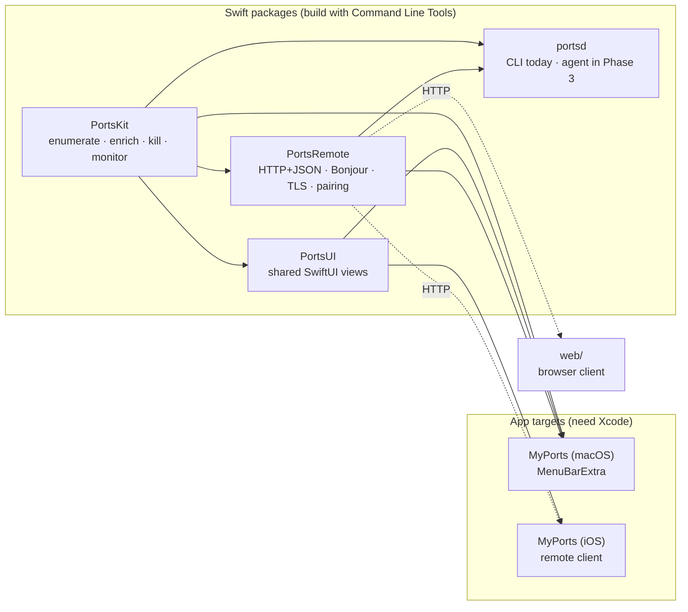

# MyPorts

See which TCP ports are open on your Mac, which app owns each one, and kill a
stray dev server or free a port in two clicks — during local development and web
testing.



> Status: early development. `PortsKit` and the `portsd` CLI are implemented and
> build today; the macOS menu-bar app, network agent, web UI, and iOS app are on
> the roadmap below. A screenshot replaces this diagram once the app exists.

## Features

- **Listening ports at a glance** — one row per listening TCP port with the port
  number, owning process, PID, bound address, and a friendly service name
  ("Vite dev server", "PostgreSQL", "Docker", …).
- **Established connections on demand** — expand a port to see the connections
  currently open against it.
- **Kill the right way** — `SIGTERM` first, escalate to `SIGKILL` if the process
  ignores it, and offer an administrator-authenticated kill when the process is
  not yours.
- **Live** — a polling monitor emits a fresh snapshot on an interval (default
  2 s) with a computed diff.
- **Planned** — a menu-bar app, a paired remote agent with a browser UI, and an
  iOS app to view and kill ports on your machines from your phone.

## Requirements

- macOS 14 or later.
- `/usr/sbin/lsof` (ships with macOS).
- **Command Line Tools** are enough to build `PortsKit` and `portsd`.
- **Full Xcode** is required for the macOS and iOS app targets, and to run the
  test suite locally (`XCTest`/`swift-testing` ship with Xcode, not the CLT).

## Install & build

```sh
git clone <repo-url> myports
cd myports
swift build                     # builds PortsKit + the portsd CLI
swift run portsd list           # try it
```

Install the CLI on your PATH:

```sh
swift build -c release
cp .build/release/portsd /usr/local/bin/
```

## Usage (`portsd` CLI)

```sh
# List every listening TCP port
portsd list

# Only loopback-bound ports, or a single port
portsd list --loopback-only
portsd list --port 3000

# Machine-readable
portsd list --json

# Free a port: SIGTERM, then SIGKILL if needed (asks first)
portsd kill 3000

# Skip the prompt / force SIGKILL immediately
portsd kill 3000 --yes
portsd kill 3000 --force
```

`portsd kill` prints a clear message when the process is not yours; re-run with
`sudo`, or use the app's "Kill as Administrator" once it exists.

## Architecture

Layered, with every collaborator injected so the logic tests without spawning a
subprocess or signalling a real process:

| Layer | Type | Responsibility |
| --- | --- | --- |
| `CommandRunner` | protocol | Run `lsof` (real) or replay a fixture (test). |
| `LsofParser` | value | Parse `lsof -F` field output into `RawSocket`s. |
| `ProcessInspector` | protocol | `proc_pidpath` / `proc_pidinfo` / `KERN_PROCARGS2` enrichment. |
| `FriendlyNameResolver` | protocol | Command + args → recognisable label and category. |
| `PortScanner` | value | Orchestrate the above into `[ListeningPort]`. |
| `Signaler` / `PortKiller` | protocol / value | `kill(2)` and the terminate → kill → privileged ladder. |
| `PortsMonitor` | actor | Poll `PortScanner` on an interval, publish an `AsyncStream`. |
| `PortsService` | value | The public entry point wiring real defaults. |

See [`docs/adr/`](docs/adr/) for the decisions behind the stack, the choice of
`lsof`, and the remote-access security model.

## Roadmap

- [x] **Phase 0 — Setup**: repo, SwiftPM skeleton, CI (lint + test), CodeQL,
      Dependabot, README, ADRs, `protect-main` ruleset (PR + green CI required).
- [x] **Phase 1 — `PortsKit`**: `lsof` runner + parser (fixtures), process
      enrichment, friendly-name heuristics, `Signaler` / `PortKiller`,
      `PortsMonitor`, full unit tests (36, green on CI). A working `portsd` CLI
      (`list`, `kill`).
- [ ] **Phase 2 — macOS menu-bar app**: `MenuBarExtra`, port list with search
      and sort, expandable established connections, kill flow (confirm → force →
      administrator), settings (refresh interval, launch at login).
- [ ] **Phase 3 — Agent + web**: `PortsRemote` + `portsd serve` (JSON API, SSE),
      Bonjour, self-signed TLS, QR pairing with revocable tokens, audit log,
      read-only mode, "Enable remote access" toggle in the app, minimal browser
      client in `web/`.
- [ ] **Phase 4 — iOS app**: device discovery + manual add, QR pairing, remote
      port list reusing `PortsUI`, remote kill, device switcher.
- [ ] **Phase 5 — Distribution**: notarized macOS `.dmg` via CD on tags, README
      screenshot/GIF, TestFlight for iOS.

## Contributing

Work happens on `develop` (or feature branches off it). `main` is protected by
the `protect-main` ruleset: changes land only through a pull request whose CI
(`Build & test (SwiftPM)` and `swift-format lint`) is green and up to date; no
force-pushes, no branch deletion, linear history.

Commits follow [Conventional Commits](https://www.conventionalcommits.org).
Run `swift format lint --strict --recursive Sources Tests Package.swift` and
`swift test` before opening a PR.

## License

To be decided.
